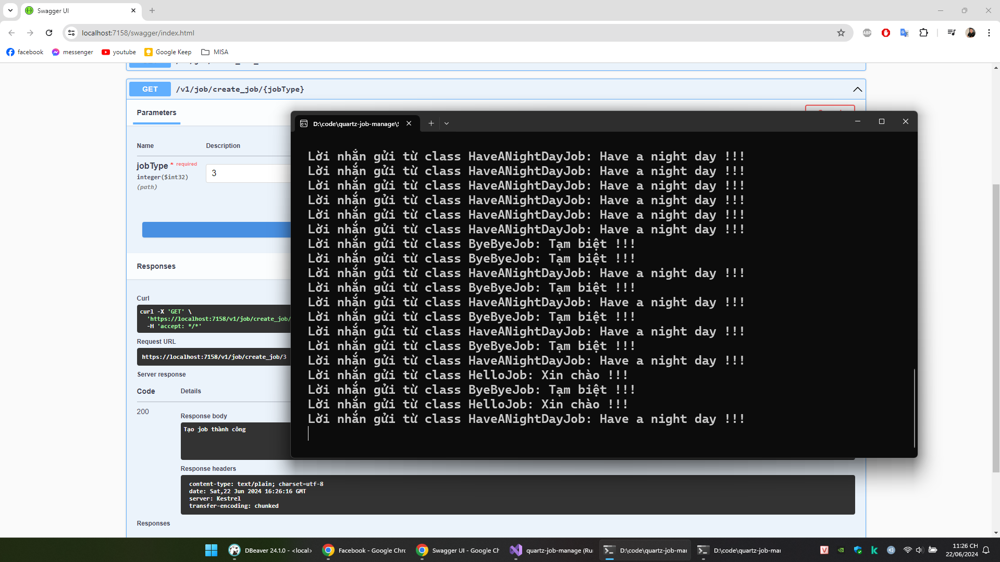
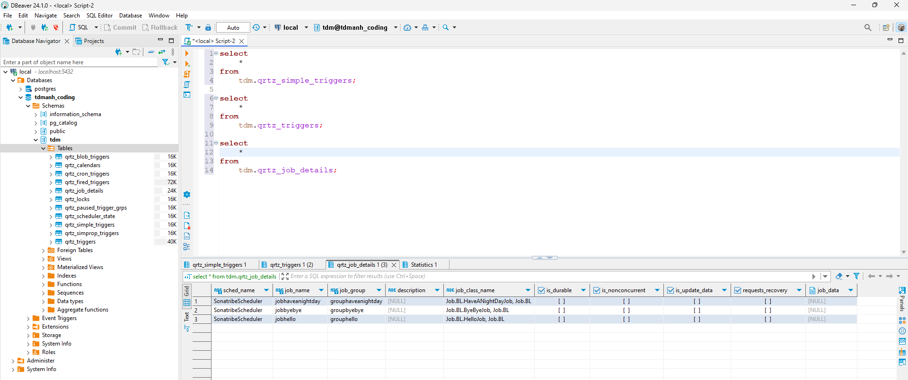
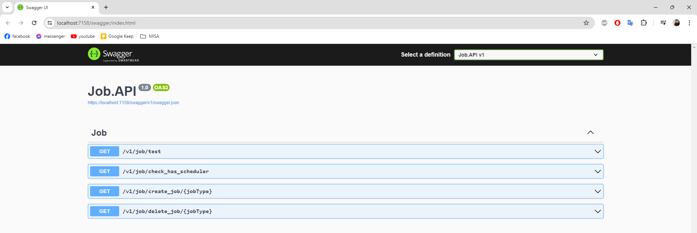
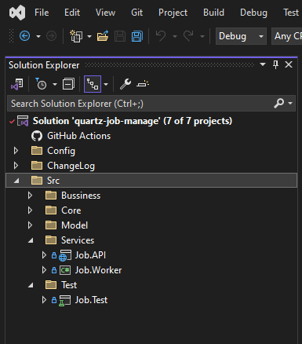
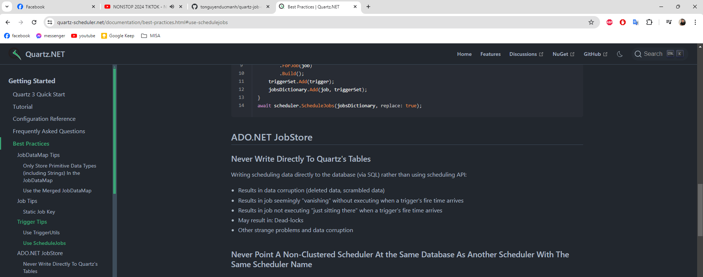
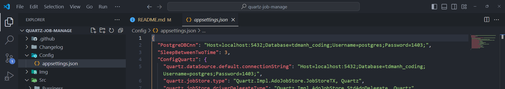
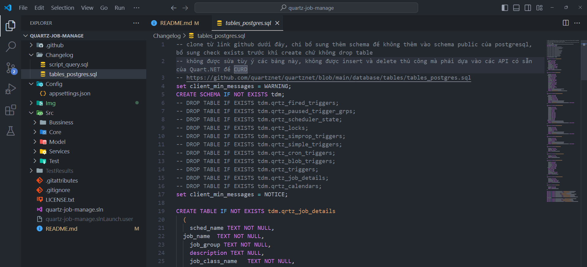

Solution lập trình việc tạo job cho worker chạy và remove job của worker.
Job được chạy bằng thư viện Quartz.NET
Các Job sẽ được lưu trữ trong database PostgreSQL

solution sẽ tạo ra 3 job khác nhau cho worker chạy
mỗi job sẽ chạy vô hạn lần, cách nhau 3 giây sẽ chạy lại

Danh sách lệnh đã tạo trong database postgreSQL

khi start solution sẽ mở ra 1 giao diện danh sách api, trong này gồm có đầu api tạo lệnh và xóa lệnh
nhập enum của job muốn tạo và xóa

2 project chính của solution là Job.API dùng để tạo và check job và Job.Worker dùng để thực thi job

Lưu ý: trong solution này sử dụng các hàm mặc định được cung cấp bởi Quartz.NET để insert và delete job trong database. Không được phép tự viết câu lệnh insert, delete, update cho các database này do có thể gây ra deadlock. Thư viện đã lo vụ này ổn rồi thì cứ dùng

Hướng dẫn chạy project

Bước 1:
Tạo 1 database mới
Dán connection string của postgreSQL local vào config

Bước 2:

Chạy toàn bộ script có trong file sau trong postgresql ở database vừa tạo

Bước 3:

Start 2 project là Job.API và Job.Worker

Bước 4:

chạy 2 api tạo lệnh và xóa lệnh, kiểm tra kết quả ở cửa sổ console của worker
